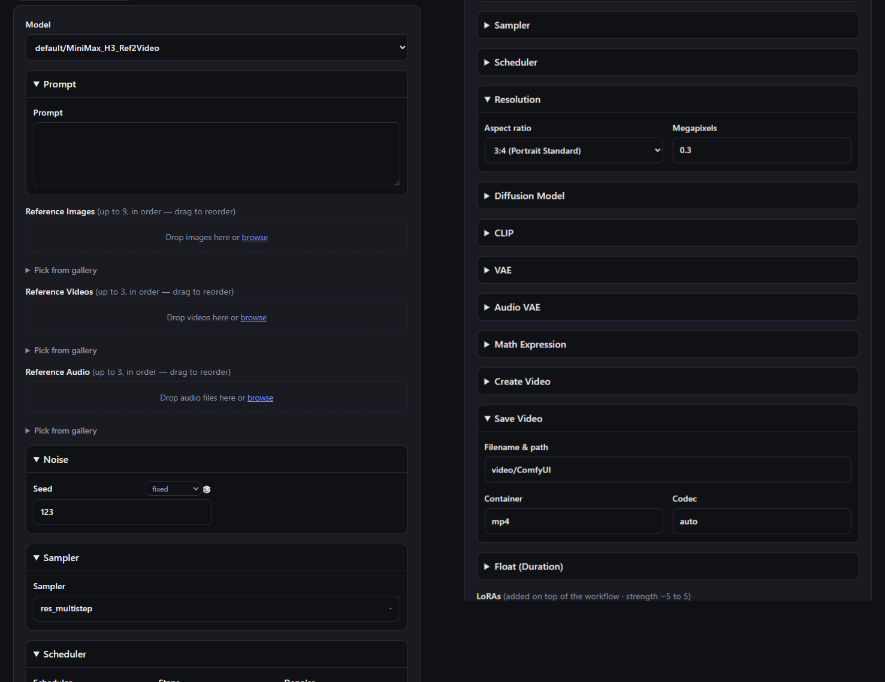

<p align="center">
  
</p>

# GENie

*Your wish, rendered.* A tiny local web app that is, first, a **friendly front-end
for your own ComfyUI** and a **project manager** for everything you generate — and,
secondarily, a client for **cloud models** via [kie.ai](https://kie.ai). Everything
runs from one UI: pick a workflow (or a cloud model) per generation and the form
adapts to it.

**Local ComfyUI — the main event.** Drop a raw ComfyUI API export into `workflows/`
and pick it from the Model dropdown like any other model. There is **nothing to
author**: GENie recognizes the nodes in the export (KSampler, prompts, latent size,
loaders, savers, …) and builds a form for them automatically, node by node. Add extra
LoRAs, toggle optional nodes, watch live sampler previews and host GPU/VRAM stats, and
carry state between runs with the Continue feature. Supporting a new node type is a
small file you drop in — no code. See [`docs/COMFYUI.md`](docs/COMFYUI.md).

**Project manager.** Every generation — local or cloud — lands in a **project** with
its own gallery, history, and output folder: drag-and-drop reference media, re-import
or re-run any past generation, and **export** a self-contained, shareable bundle of a
project's history. Your whole library of prompts, references, and results stays
organized on your own disk.

**Cloud models (optional)** via [kie.ai](https://kie.ai): **Seedance 2.5** /
**Seedance 2** / **Seedance 2 Fast** / **Seedance 2 Mini** (video; 2.5, Fast and Mini
are 480p/720p only — 2.5 adds start/end keyframes, an adaptive aspect ratio, up to 30s
duration, and mp4/mov output) and **Seedream 5.0 Lite** image-to-image / text-to-image
(the form adapts: quality tier instead of resolution/duration, image references only —
or none at all for text-to-image — and results display as images). Add a kie.ai API key
to enable these; skip it and GENie is a pure ComfyUI front-end.

A small Express server runs the whole thing locally: local ComfyUI runs talk to your
own ComfyUI instance, and — if you add a key — it keeps that key server-side (never
exposed to the browser) and proxies requests to kie.ai. A single-page UI lets you
submit a prompt + reference media, then polls until the result is ready.



> **API reference:** local copies of the kie.ai model docs (parameters per model,
> shared endpoints, and known discrepancies) live in
> [`docs/kie-api/`](docs/kie-api/README.md) so you don't have to re-check the web.

## Features

### Local ComfyUI front-end

- **Zero-authoring workflows** — drop a raw **File → Export (API)** `.json` in
  `workflows/` and GENie recognizes its nodes and builds the form automatically,
  rendering each recognized node as its own collapsible section. Nodes it doesn't
  recognize run exactly as saved. See [`docs/COMFYUI.md`](docs/COMFYUI.md).
- **Extensible by data, not code** — supporting a new node type is a small JSON file
  in [`node_types/`](node_types/); no server changes. A file you add can also override
  a shipped one.
- **Live model options** — dropdowns for models, LoRAs, VAEs, and samplers fill from
  your running ComfyUI (`/object_info`), and number fields pick up their real
  min/max/step, so you pick from exactly what's installed.
- **Dynamic LoRAs & optional nodes** — add extra LoRAs to any checkpoint workflow, and
  flip `_meta.bypassable` "patch" nodes on/off (they're removed and reconnected at
  generate time) without editing the graph.
- **Live previews & host stats** — a run's card shows the frame forming each sampler
  step plus a CPU/GPU/VRAM strip; an optional
  [filmstrip node](docs/COMFYUI.md#filmstrip-previews) turns a video preview into a
  grid across the clip.
- **Continue** — workflows that carry state between runs get an opaque per-run id and
  a Continue button, so a second clip can pick up where the first left off.

### Project manager

- **Projects** — divide generations into projects via the header switcher (＋ new,
  ✎ rename, 🗑 delete). Each project gets its own `input/<slug>/` and
  `output/<slug>/` subfolders; the gallery is strictly per-project and history can
  be filtered by project (or All). Re-running another project's generation warns
  before saving the result to the active project. Deleting a project moves its
  media and history to Default. Pre-project data is auto-migrated to Default on
  first start.
- **Generation history** — every successful generation (local or cloud) is saved to
  `history.json` with its prompt, settings, references, and — for cloud runs —
  measured credit cost. Each entry has **Re-import** (load the settings back into the
  form) and **Re-run** (load + generate again).
- **Media gallery** — every dropped file is kept in a per-project gallery (video/audio
  get a kind badge); expand it to click any past item back into the matching reference
  list.
- **Drag-and-drop reference media** — images, videos, and audio each have a dropzone:
  drop local files (or click to browse, or drag a URL in). Thumbnails are labeled and
  reorderable — drag to re-sort and the labels update. Each has an **×** to remove and
  a **Clear all** button.
- **Saved results** — finished videos/images are downloaded into the `output/` folder,
  and the history record links to the local copy (and, for cloud runs, the original
  URL).
- **Export** — the **📦 Export** button (next to Open folder) writes the shown
  history to a new self-contained subfolder in `exports/`: a standalone
  `index.html` (prompt + reference thumbnails on the left, the result on the
  right, all click-to-enlarge, with model/resolution/aspect/duration/credit-cost
  details) plus `input/` and `output/` folders holding copies of every reference
  and result file. Zip the folder to share it — it needs no server. Exports one
  project at a time (pick a specific project in the History filter first); override
  the location with `EXPORTS_DIR` in `.env`.
- **Reload-safe** — the in-flight task id is saved to `localStorage`, so closing or
  reloading the tab mid-generation resumes polling automatically on the next load
  (generations can take 5+ minutes; nothing is held on an open connection).

### kie.ai cloud (optional)

- **Cloud reference hosting** — dropped files are saved locally and only uploaded to
  kie.ai's file host at generate time, so kie.ai's ~3-day URL expiry never matters;
  re-runs re-host saved references automatically. In prompts, `@Image1`/`@Video1`/…
  match the reference thumbnail labels.
- **Live credit balance** — shown in the header (`GET /api/v1/chat/credit`), with a
  refresh button.
- **Cost estimate** — kie.ai has no price-preview API, so cost is *measured*: the
  exact `creditsConsumed` reported by the task-detail API (falling back to the
  credit-balance delta around the run) is stored in history. The estimate next to
  the Generate button is seeded from known per-second rates (480p ≈ 19 credits/s,
  720p ≈ 41 credits/s, audio on) and refines itself from your measured runs per
  resolution + audio setting. Reference videos appear to bill by the combined
  input + output duration, so their measured lengths are added to the estimate
  (with a warning if they exceed the 15s total input limit).

## Setup

> **New to git, Node, or the terminal?** Follow the step-by-step
> [beginner's install guide](INSTALL.md) instead — no prior knowledge needed.

You'll need [Node.js](https://nodejs.org) 18+ (uses the built-in `fetch`).

```bash
# 1. Install dependencies
npm install

# 2. Create your config (optional: add a kie.ai key for cloud models)
cp .env.example .env        # on Windows: copy .env.example .env
#   for the cloud models, edit .env and paste your key from https://kie.ai/api-key
#   — skip this and GENie runs as a pure ComfyUI front-end

# 3. Run it
npm start
```

Open <http://localhost:3000> in your browser.

For auto-restart while developing: `npm run dev`.

To run **local ComfyUI workflows**, point GENie at your ComfyUI instance (defaults to
`http://127.0.0.1:8188`) — see [`docs/COMFYUI.md`](docs/COMFYUI.md). No API key needed
for local workflows.

## Getting an API key (for cloud models)

The kie.ai key is only needed for the **cloud** models — local ComfyUI workflows don't
use it. To enable the cloud models:

1. Go to <https://kie.ai/api-key>
2. Create a key and copy it into `.env` as `KIE_API_KEY=...`

**Each person running the app needs their own key**, and cloud generations are billed
to the key's account.

## Updating to a newer version (complete beginner)

> ⚠️ **One-time step if you have data from before the folder rename.** The data
> folders were renamed `video → output` and `images → input`. If your copy still
> has old `video/` / `images/` folders after updating, stop the app and run this
> once to move them and fix your saved history/gallery links (it backs up the JSON
> first, and is safe to re-run):
>
> ```
> node migrate-folders.cjs
> ```

New features and fixes land over time. How you update depends on how you first
**got** the app. Not sure which you did? If your app folder contains a hidden
`.git` folder, you cloned it — use the git steps. If you downloaded and unzipped
a file, use the ZIP steps.

Whichever method you use, your personal stuff is always kept:

- **`.env`** — your API key, password, and any settings
- **`history.json`, `images.json`, `projects.json`** — your generation history,
  gallery, and projects
- **the `output` and `input` folders** — your generated results and reference media

> 💡 Five-second safety net: before updating, make a copy of your whole app
> folder (right-click → Copy, then Paste) so you can fall back to it if anything
> goes wrong.

### If you downloaded the ZIP

You're not using git, so you re-download and carry your personal files across:

1. On the project's GitHub page, click the green **`<> Code`** button →
   **Download ZIP**, and unzip it into a **new** folder (don't overwrite the old
   one yet).
2. From your **old** app folder, copy these into the **new** folder, replacing
   what's there when asked:
   - the file `.env`
   - any of `history.json`, `images.json`, `projects.json` that exist
   - the `output` folder and the `input` folder

   *(These files are hidden from GitHub on purpose, so the new download won't
   contain them — that's why you copy your own across.)*
3. Open a terminal in the **new** folder (see the
   [install guide](INSTALL.md#step-3--open-a-terminal-in-the-project-folder) if
   you're unsure how) and run:

   ```
   npm install
   ```

4. Start it as usual with `npm start`. Once you've confirmed the new folder
   works, you can delete the old one.

### If you cloned with git

Your personal files are ignored by git, so they're left untouched — updating is
two commands. Open a terminal in the app folder and run:

```
git pull
npm install
```

Then start it again with `npm start`.

- `git pull` downloads the latest code. `npm install` picks up any new libraries
  (safe to run even when there are none).
- If `git pull` prints something about **"local changes"** that would be
  overwritten, it means you edited a tracked file. If you didn't change anything
  on purpose, run `git stash` first, then `git pull` again. If you're stuck,
  the ZIP method above always works as a fallback.

## Security / sharing notes

- **Never commit `.env`.** It holds your secret API key and is listed in
  `.gitignore`. Only `.env.example` (a key-less template) is tracked.
- If you deploy this somewhere public, anyone who can reach the URL can spend your
  API credits, since the key lives on the server. Keep it local or behind auth.

## Accessing from other devices on your home network

By default the server listens on `127.0.0.1`, so only the PC it runs on can reach
it. To open it to your phone/laptop on the same Wi-Fi:

1. Set `HOST=0.0.0.0` in `.env` and restart (`npm start`).
2. The startup message prints the URL(s) to use, e.g. `http://192.168.1.50:3000`.
   Enter that on the other device's browser.
3. On Windows you may get a one-time "Allow Node.js through the firewall" prompt —
   allow it for **Private** networks only.

By default there is **no login**, so anyone on your network who opens that URL can
use the app and spend your kie.ai credits. Set a password (below) if you enable
LAN access. Either way, only enable it on a network you trust, and **never**
port-forward it or otherwise expose it to the public internet.

## Password protection (optional)

Set `APP_PASSWORD` in `.env` and restart to require a password before the app can
be used:

```
APP_PASSWORD=your-shared-password
```

When set, every page, API call, and saved media file requires signing in first —
a simple password page appears until you enter it. The sign-in is remembered in a
cookie for 30 days per browser. Leave `APP_PASSWORD` blank/unset for no login
(the default). Recommended whenever you turn on LAN access. Note this is a single
shared password meant for a trusted home network, not per-user accounts.

## How it works

| Endpoint | What it does |
| --- | --- |
| `POST /api/create` | Builds the `bytedance/seedance-2` payload and calls `createTask`. |
| `GET /api/status?taskId=...` | Proxies `recordInfo` so the UI can poll for the result. |
| `GET /api/credits` | Proxies the account credit balance. |
| `GET/POST /api/projects`, `PUT/DELETE /api/projects/:id` | Project CRUD; delete moves contents to Default. |
| `POST /api/upload` | Saves dropped media (image/video/audio) to `input/` locally — no API call. |
| `POST /api/reupload` | Hosts a saved local file (by id) on kie.ai at generate time; returns a fresh URL. |
| `GET /api/images` | Lists the saved media gallery. |
| `DELETE /api/images/:id` | Removes an item from the gallery. |
| `POST /api/save` | Downloads the finished video into `output/` and appends the record (incl. measured cost) to `history.json`. |
| `GET /api/history` | Returns the saved generation history. |

The browser never sees `KIE_API_KEY` — it only talks to this local server.

## Project layout

```
server.js          Express proxy (holds the API key)
public/index.html  UI
public/style.css   styling
public/app.js      form handling, image upload, polling, history
.env.example       template — copy to .env and add your key
output/<project>/   downloaded result videos (git-ignored, created at runtime)
input/<project>/  saved reference media — images/video/audio (git-ignored, created at runtime)
exports/<name>/    shareable history bundles from the Export button (git-ignored, created at runtime)
history.json       generation history (git-ignored, created at runtime)
images.json        saved-media gallery manifest (git-ignored, created at runtime)
projects.json      project list (git-ignored, created at runtime)
```

The `output/` and `input/` locations can be moved off the app folder by setting
`OUTPUT_DIR` and/or `INPUT_DIR` in `.env` (absolute path, or relative to the app
folder). The per-project subfolders are still created inside whatever you choose.

## License & Disclaimer

This project is licensed under the [MIT License](LICENSE). In plain English:

**This software is provided "as is", without warranty of any kind, and you use
it entirely at your own risk.** By downloading or running it you accept that
the author is **not responsible or liable** for:

- any damage to your computer, files, or data;
- any charges, credit consumption, or costs incurred on your kie.ai account
  (every generation spends real credits — the cost estimates shown in the app
  are approximations, not guarantees);
- anything you create, generate, publish, or otherwise do with this software
  or its outputs — that's on you, including complying with kie.ai's and
  ByteDance's terms of service and the laws that apply to you;
- the safekeeping of your API key. Your key is stored in a local `.env` file
  and sent only to kie.ai. If you commit it, share it, screenshot it, paste it
  somewhere public, or otherwise leak it, anyone who has it can spend your
  credits. Guard it accordingly.

This is an unofficial hobby tool. It is **not affiliated with, endorsed by, or
supported by kie.ai or ByteDance**. Their APIs, models, pricing, and terms can
change at any time and break this app without notice.
